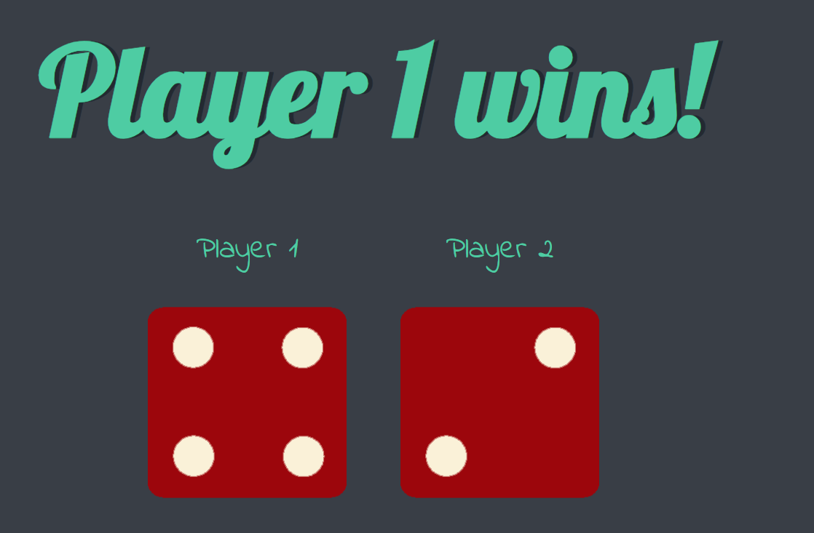

# 🎲 Dice Game 🎲

Welcome to **Dicee**, a fun two-player dice game built using HTML, CSS, and JavaScript! Simply refresh the page to roll the dice, and see which player wins.

## 🚀 Project Overview

This project is a simple personal project I developed to **learn and practice JavaScript**. The game dynamically generates random dice rolls for two players and declares the winner based on the dice outcome.

### 🏆 Features:
- **Random Dice Rolls**: Each time you refresh the page, the dice roll results are generated randomly for both players.
- **Instant Feedback**: The game immediately declares a winner or announces a draw.
- **Responsive Design**: The interface is simple and responsive, ensuring an enjoyable experience across devices.

---

## 💻 Technologies Used

- **HTML5**: Provides the structure and content of the game.
- **CSS3**: Styles the page and adds aesthetic touches.
- **JavaScript**: Powers the game logic, generating random dice rolls and updating the page content dynamically.
- **Google Fonts**: Custom fonts for a fun and playful look.

---

## 📚 What I Learned

This personal project helped me enhance my **JavaScript** skills by working with:
- Functions for generating random numbers.
- **DOM Manipulation**: Selecting elements and updating their attributes dynamically.
- Handling conditional logic to update the game result (player wins, draws, etc.).

I also practiced using **HTML and CSS** to build a responsive and visually appealing interface.

---

## 📸 Screenshots

---

**Developed with ❤️ by [Rimjhim](https://github.com/rimjhimsingh)**
